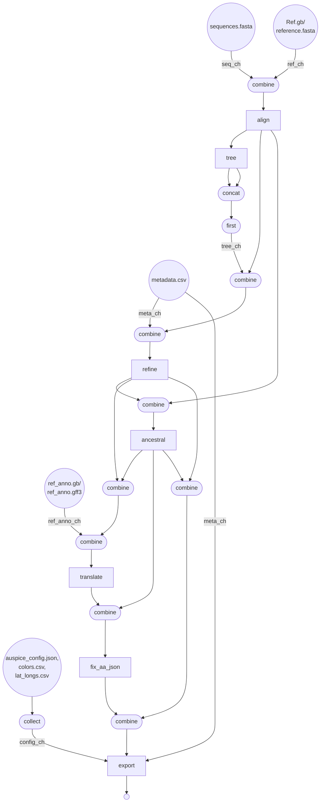

## Introduction

Nextflow pipeline for generation of phylogenetic trees to be visualized with Auspice. 
FLUFLO is written by JMC and adapted from a snakefile by Kimia Kamelian which generates 
phylogenies with the Augur bioinformatic toolkit (MAFFT, IQ-TREE, TimeTree..) that can be visualized in Auspice from [Nextstrain](https://docs.nextstrain.org/projects/auspice/en/stable/index.html)

The original intent of the pipeline was for Influenza A sequences, with the flexibility
afforded by Nextflow to be applied to other pathogens, used with various workload managers (SGE vs. SLURM),
and easily adjusted.

## Table of Contents

- [Introduction](#introduction)
- [Quick-Start Guide](#quick-start%guide)
- [Dependencies](#dependencies)
- [Installation](#installation)
- [Input](#input)
- [Output](#output)
- [Workflow](#workflow)
- [References](#references)

## Quick-Start Guide

Change into project directory:
```
cd /home/user/flu/fluflo/
```
Run FLUFLO pipeline:
```
nextflow run main.nf -profile conda --work_dir /home/user/flu/input_data/
```
For details on available arguments, enter:
```
nextflow run main.nf --help
```

## Dependencies

[Conda](https://conda.io/projects/conda/en/latest/user-guide/install/index.html) is required to build an environment with required workflow dependencies.

This bioinformatic pipeline requires Nextflow:
```
conda install -c bioconda nextflow
```
or download and add the nextflow executable to a location in your user $PATH variable:
```
curl -fsSL get.nextflow.io | bash
mv nextflow ~/bin/
```
Nextflow requires Java v8.0+, so check that it is installed:
```
java -version
```
The OS-independent conda environment activated upon running fluflo is specified in the
```environment.yml``` file of the project directory and is built when 
```-profile conda``` is included in the command line. Nextflow will save
the environment to the project directory by default. Alternatively, the 
necessary conda environment can be saved to a different shared location 
accesible to compute nodes by adding ```--conda_cache /path/to/new/location/```.

## Installation

To copy the program into a directory of your choice, from desired directory run:
```
git clone https://github.com/j3551ca/fluflo.git
cd fluflo
nextflow run main.nf -profile conda --work_dir /home/user/flu/input_data/
```
or run directly using:
```
nextflow run j3551ca/fluflo -profile conda --work_dir /home/user/flu/input_data/
```

## Input

The pipeline requires the following files which should be present in the config
and data folders of the directory containing sequences to be analyzed. These
are named the same within different directories - the only thing that needs to be changed
each run is the input directory, which can be specified with the --work_dir flag on the
command line.

- Multi-fasta file containing consensus sequences of interest [./data/sequences.fasta]
- One of the two following configurations is required to describe the reference genome:
  1. A single GenBank file passed to `--ref` describing the reference genome used for both alignment and amino acid annotation [./config/Ref.gb] OR 
  2. A reference sequence in FASTA format under `--ref` AND a reference annotation in GFF format under `--ref_anno`.
- File containing metadata for sequences under analysis [./data/metadata.csv]
- Excluded strains/ samples [./config/dropped_strains.txt]
- Colors used in final auspice visualization [./config/colors.csv]
- Sample latitudes and longitudes [./config/lat_longs.csv]
- Specifications for visualization in auspice (ex. title) [./config/auspice_config.json]

## Output

The output directories are 'results', 'auspice', and 'reports'.

results:
- aligned.fasta
- aligned.fasta.treefile
- branch_lengths.json
- tree.nwk
- nt_muts.json
- aa_muts.json

*NOTE: results folder generated by fluflo has less files than the results folder
produced with the original snakefile because they are extraneous to the analysis,
thus, designed not to be captured in Nextflow channels and copied to the results
directory.

auspice:
- flu_na.json

reports:
- fluflo_usage.html
- fluflo_timeline.html
- fluflo_dag.html


## Workflow




## References

1. Hadfield, J. et al. NextStrain: Real-time tracking of pathogen evolution. Bioinformatics 34, 4121–3 (2018).

2. Huddleston J, Hadfield J, Sibley TR, Lee J, Fay K, Ilcisin M, Harkins E, Bedford T, Neher RA, Hodcroft EB, (2021). Augur: a bioinformatics toolkit for phylogenetic analyses of human pathogens. Journal of Open Source Software, 6(57), 2906, https://doi.org/10.21105/joss.02906

3. Katoh, K., Misawa, K., Kuma, K., & Miyata, T. (2002). MAFFT: a novel method for rapid
multiple sequence alignment based on fast Fourier transform. Nucleic Acids Research,
30(14), 3059–3066. https://doi.org/10.1093/nar/gkf436

4. Nguyen, L.-T., Schmidt, H. A., Haeseler, A. von, & Minh, B. Q. (2014). IQ-TREE: A Fast and
Effective Stochastic Algorithm for Estimating Maximum-Likelihood Phylogenies. Molecular Biology and Evolution, 32(1), 268–274. https://doi.org/10.1093/molbev/msu300

5. Sagulenko, P., Puller, V., & Neher, R. A. (2018). TreeTime: Maximum-likelihood phylodynamic analysis. Virus Evolution, 4(1). https://doi.org/10.1093/ve/vex042
