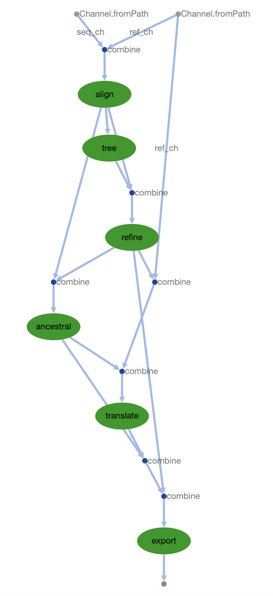

# fluflo
Nextflow pipeline for generation of phylogenetic trees to be visualized in Auspice. 

## Introduction

FLUFLO is a Nextflow pipeline written by JMC that has been adapted from a snakefile by
Kimia Kamelian which generates phylogenetic trees that can be visualized in Auspice from
[Nextstrain](https://docs.nextstrain.org/projects/auspice/en/stable/index.html)

The original intent of the pipeline was for Influenza A sequences, with the flexibility
afforded by Nextflow, to be applied to other pathogens, used with various executors (SGE vs. SLURM),
and easily adjusted.

## Table of Contents

- [Introduction](#introduction)
- [Quick-Start Guide](#quick-start%guide)
- [Dependencies](#dependencies)
- [Installation](#installation)
- [Input](#input)
- [Output](#output)
- [Workflow](#workflow)

## Quick-Start Guide

Change into project directory:
```
cd /home/jess.cal/flu/fluflo/
```
Run FLUFLO pipeline:
```
nextflow run main.nf -profile conda --work_dir "/home/user/flu/input_data/"
```
For details on available arguments, enter:
```
nextflow run main.nf --help
```

## Dependencies

This bioinformatic pipeline requires Nextflow:
```
conda install -c bioconda nextflow
```
or download and add the nextflow executable to a location in your user $PATH variable:
```
curl -fsSL get.nextflow.io | bash
mv nextflow ~/bin/
```
Nextflow requires Java v8.0+, so check that it is installed:
```
java -version
```
The conda environment activated upon running fluflo is from
/home/kkamelian/.conda/envs/nextstrain/

## Installation

To copy the program into a directory of your choice, from desired directory run:
```
git clone https://github.com/j3551ca/fluflo.git
cd fluflo
nextflow run main.nf -profile conda --work_dir "/home/user/flu/input_data/"
```
or run directly using:
```
nextflow run j3551ca/fluflo -profile conda --work_dir "/home/user/flu/input_data/"
```

## Input

The pipeline requires the following files which should be present in the config
and data folders of the directory containing sequences to be analyzed. These
are named the same within different directories - the only thing that needs to be changed
each run is the input directory, which can be specified with the --work_dir flag on the
command line.

- Multi-fasta file containing consensus sequences of interest [./data/sequences.fasta]
- Reference genome used to align reads to during guided assembly [./config/Ref.gb]
- File containing metadata for sequences under analysis [./data/metadata.csv]
- Excluded strains/ samples [./config/dropped_strains.txt]
- Colors used in final auspice visualization [./config/colors.csv]
- Sample latitudes and longitudes [./config/lat_longs.csv]
- Specifications for visualization in auspice (ex. title) [./config/auspice_config.json]

## Output

The output directories are 'results', 'auspice', and 'reports'.

results:
- aligned.fasta
- aligned.fasta.treefile
- branch_lengths.json
- tree.nwk
- nt_muts.json
- aa_muts.json

*NOTE: results folder generated by fluflo has less files than the results folder
produced with the original snakefile because they are extraneous to the analysis,
thus, designed not to be captured in Nextflow channels and copied to the results
directory.

auspice:
- flu_na.json

reports:
- fluflo_usage.html
- fluflo_timeline.html
- fluflo_dag.html


## Workflow


